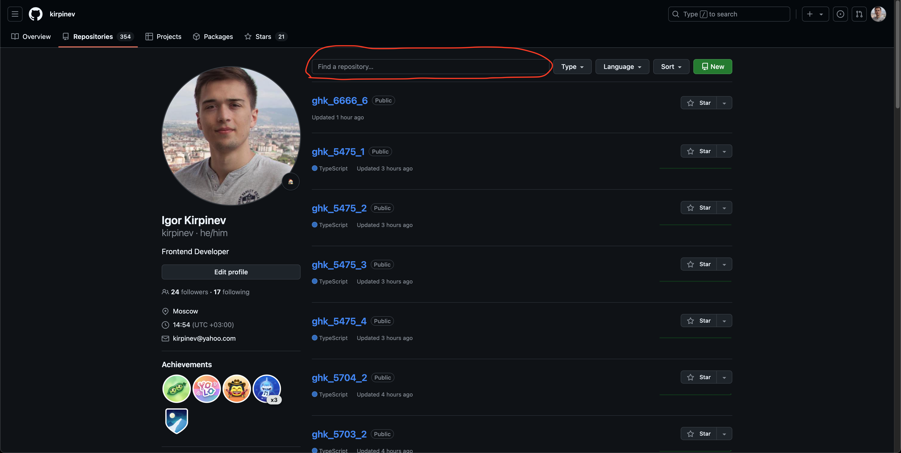
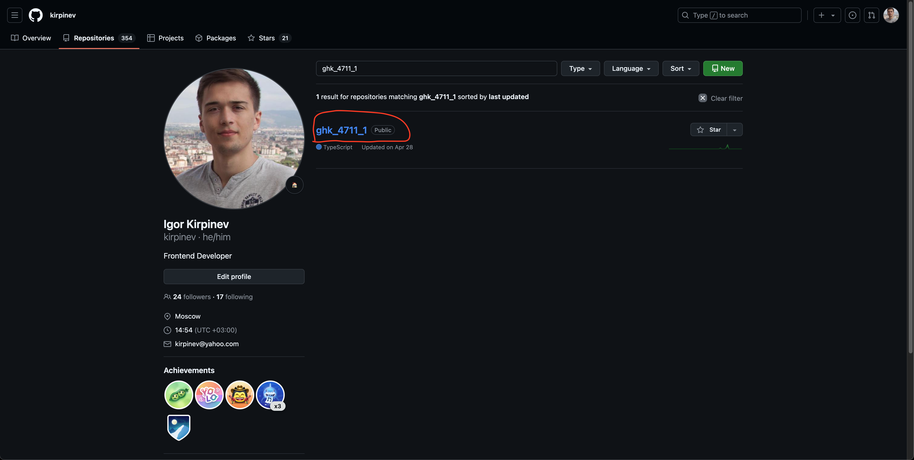
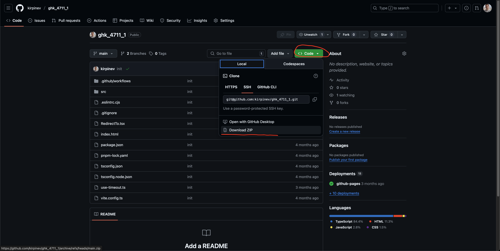
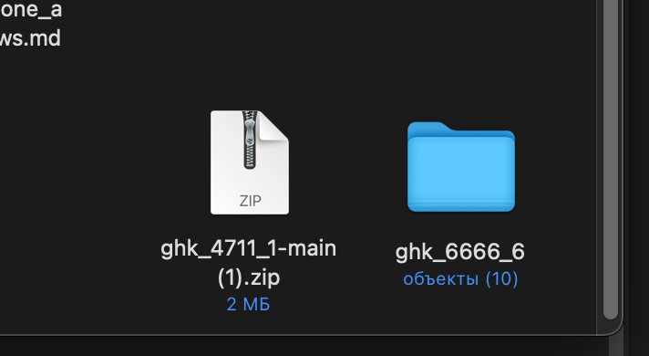
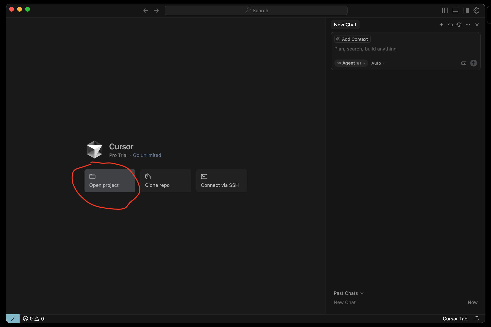
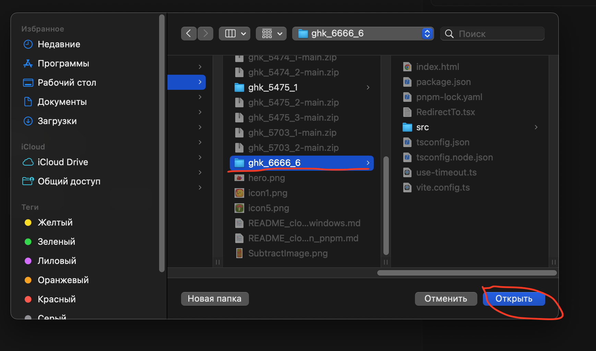
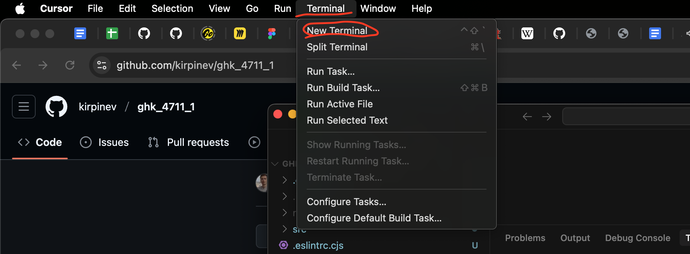
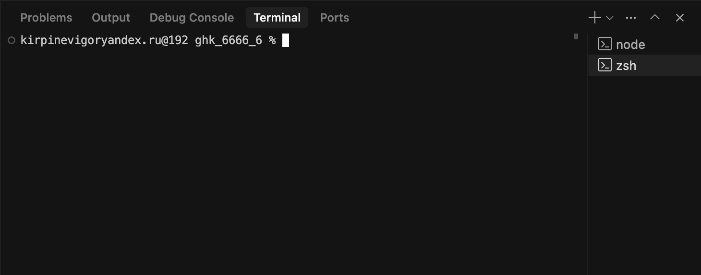
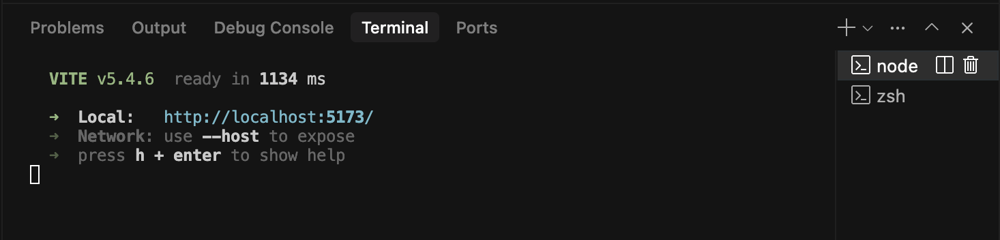
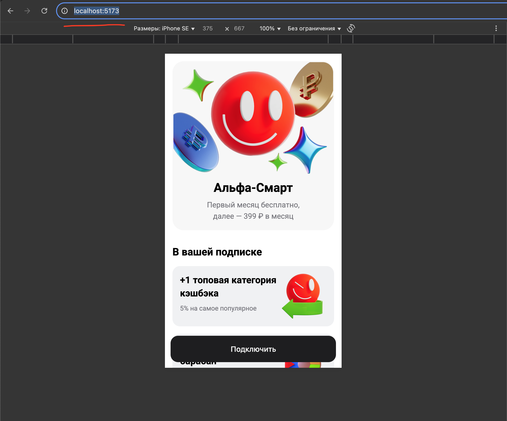

# Клонируем и запускаем понравившийся вариант эксперимента на macOS

---

## 1. Находим на Github понравившийся вариант эксперимента

Все запущенные эксперименты можно найти в репозиториях JS разработчиков GH. Тут [Костя](https://github.com/woophi?tab=repositories) 
или тут [Игорь](https://github.com/kirpinev?tab=repositories). Эксперименты искать довольно просто, например хочется модифицировать эксперимент который в Jira под номером `GHK-4711`, все что нужно сделать это в поиске

написать строчку такого формата ghk_6666_6, где `6666` номер эксперимента, а `6` номер варианта эксперимента. 
Так как нам интересен эксперимент 4711 и мы знаем что у экспериментов есть хотя бы один вариант то смело пишем в поиске строчку такого вида `ghk_4711_1`. Нашли нужный вариант эксперимента и щелкаем на ссылку.


---

## 2. Скачиваем понравившийся вариант эксперимента

На странице эксперимента нужно щелкнуть на зеленую кнопку `Code`, а затем на строчку `Download ZIP`.


---

## 3. Настраиваем проект локально

После скачивания распакуйте проект, и сразу переименуйте. До этого мы создали тестовый репозиторий на Github под названием `ghk_6666_6`, давайте переименуем наш локальный проект по такому же принципу.



### 👩🏻‍🦳👩🏻‍🦳👩🏻‍🦳 *Имя локального репозитория (папки) должно совпадать с именем удаленного репозитория (папки) на Github, так меньше путаницы* 👩🏻‍🦳👩🏻‍🦳👩🏻‍🦳

---

## 4. Запускаем проект в Cursor

Запускам Cursor, щелкаем на кнопку `Open Project`.


Находим скачанный и переименованный проект локально, щелкаем один раз на папку и затем на синюю кнопку `Открыть` или `Open`.


Теперь нужно открыть терминал в Cursor. На верхней, системной панели навигации щелкайте на слово `Terminal`, 
в открывшемся попапе щелкайте на слово `New Terminal`.


Если все сделали правильно, то в Cursor внизу увидите такое окошко.


Осталось последовательно ввести в терминале несколько команд:

1. Инициализируем локальный Git репозиторий
```bash
git init
```
2. Устанавливаем необходимые модули `Node.js`
```bash
pnpm install
```
### 👩🏻‍🦳👩🏻‍🦳👩🏻‍🦳 *После второй команды важно подождать чуть-чуть, установка бывает долгой, если все установилось хорошо, то в консоли увидите слово `Done`* 👩🏻‍🦳👩🏻‍🦳👩🏻‍🦳
3. Запускаем наш проект локально
```bash
pnpm run dev
```

В консоли появится такой вывод.


Адрес, который вы видите `http://localhost:5173/`, это адрес на котором сейчас запустился наш проект локально, 
его можно скопировать и вставить в адресную строку браузера.


---

## Готово!

Теперь можно экспериментировать над проектом локально, менять текст, добавлять новые элементы и картинки. После того как 
Cursor внесет правки возвращайтесь в окно браузера, все изменения обновятся автоматически без перезагрузки страницы.
