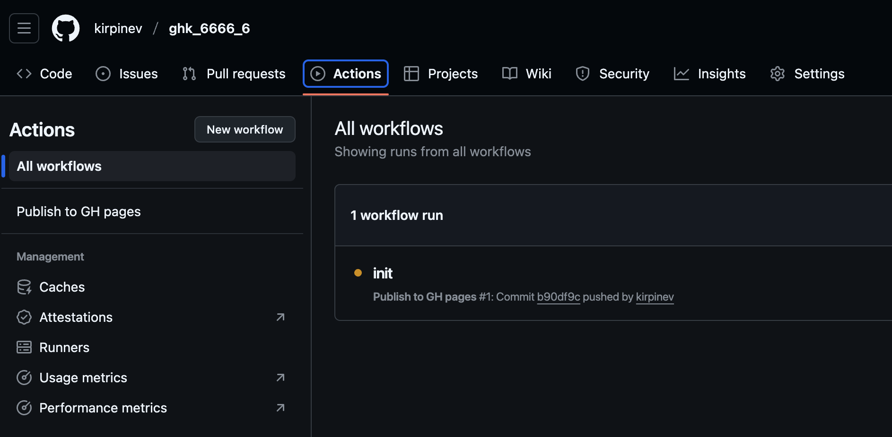
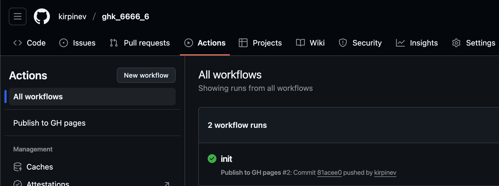
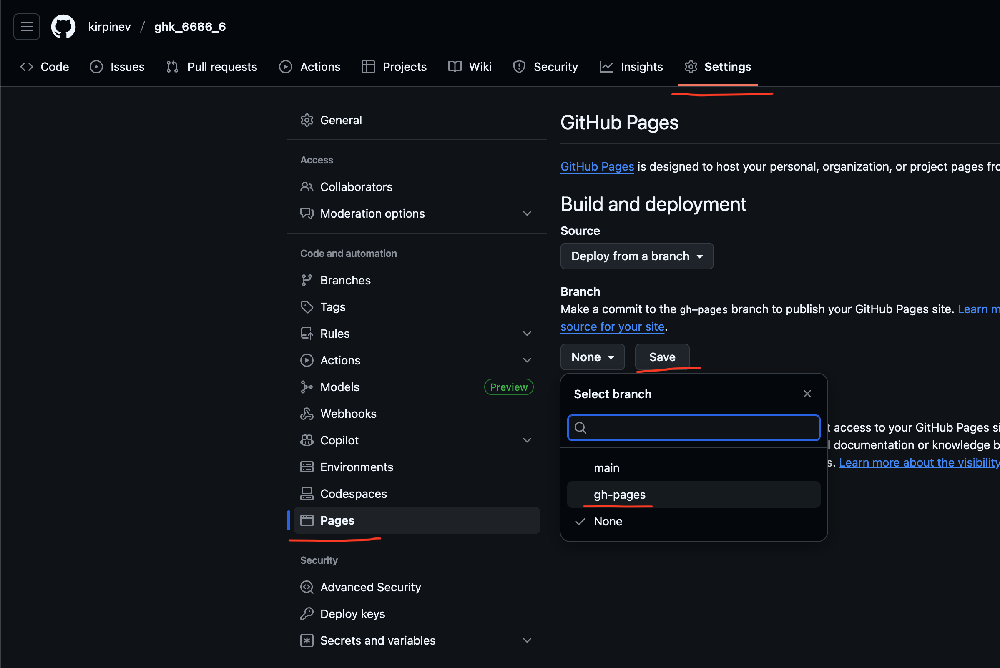
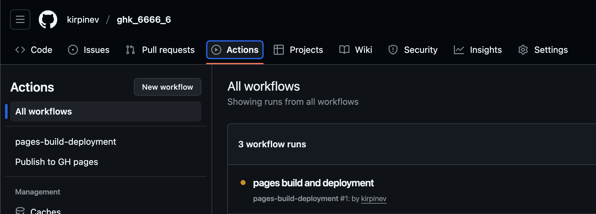
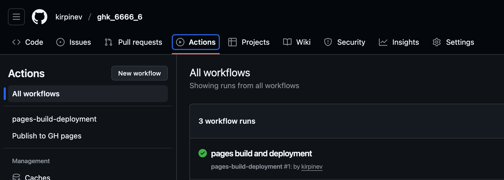
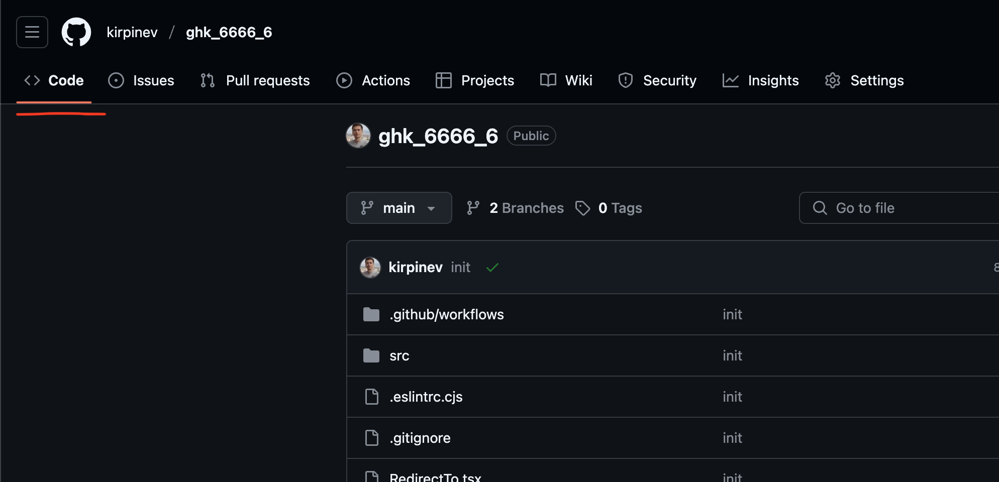
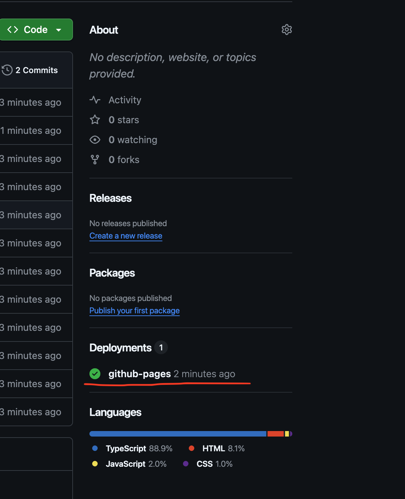
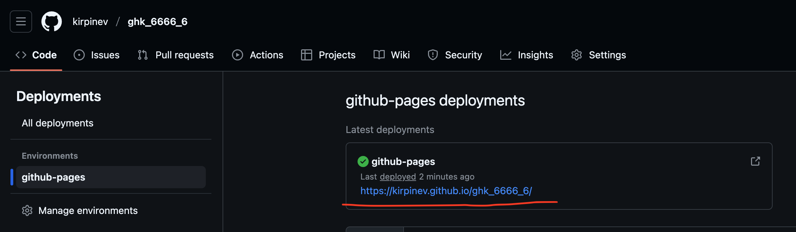

# Хостим проект

Эта инструкция поможет опубликовать проект на GitHub Pages.

---

## 1. Настраиваем gh-pages

После пуша проекта на гитхаб нужно на странице проекта зайти во вкладку `Actions` и подождать пока статус коммита с желтого цвета

поменяется на зеленый.

Затем переходим в `Setting`, на вертикальной панели слева выбираем `Pages`, после этого в правой вертикальной панели щелкаем на 
выпадашку `None` и в меню выбираем `gh-pages`, щелкаем после этого на кнопку `Save`.

---

## 2. Ждем билд

Переходим обратно во вкладку `Actions` и ждем пока задача `pages build and deployment` из желтого статуса

перейдет в зеленый статус.

---

## Готово!

Переходим во вкладку `Code`.

Справа на вертикальной панели щелкаем `github-pages`.

И далее щелкаем на ссылку раскатившего эксперимента.

