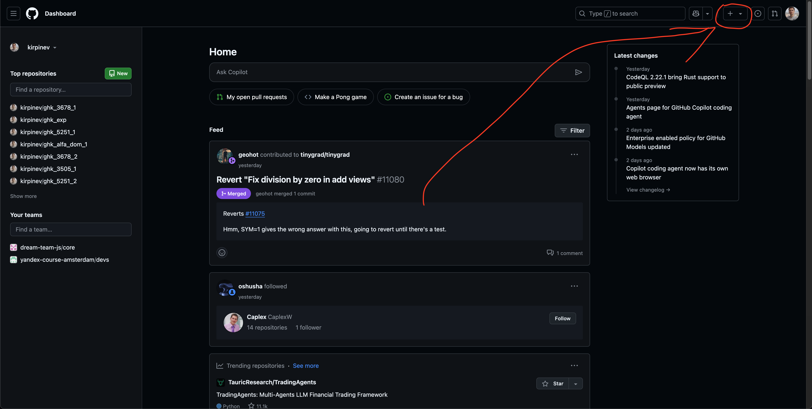
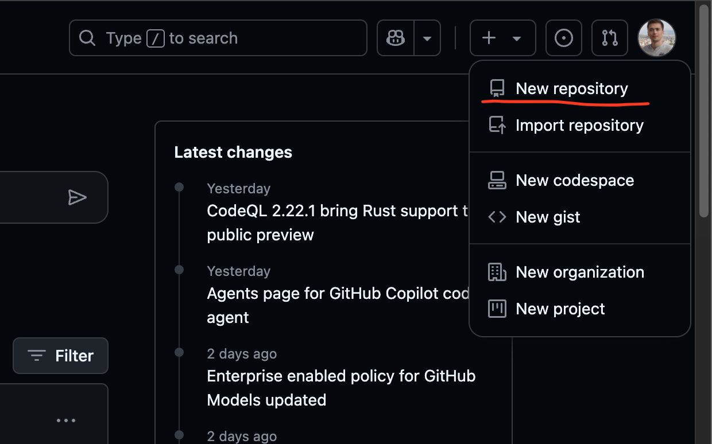
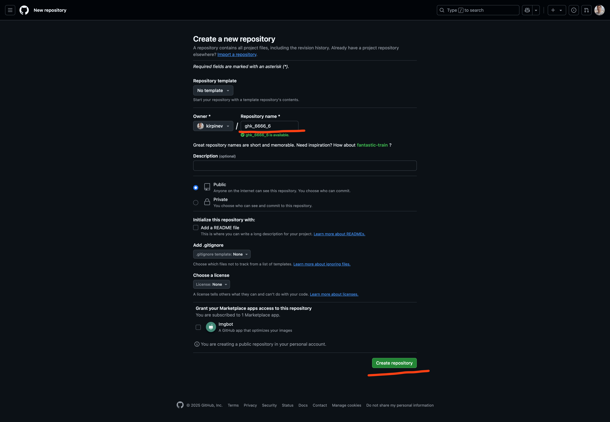

# Создание репозитория на Гитхабе

---

## 1. Открываем Гитхаб

Переходим по адресу [https://github.com](https://github.com) и щелкаем на плюсик справа вверху:

---

## 2. Новый репозиторий

Щелкаем в попапе на строчку `New repository`:

---

## 3. Придумываем имя и в путь

После этого на странице придумываем имя репозитория и нажимаем на зеленую кнопку `Create repository`, имя должно быть 
по шаблону `ghk_6666_6`, где `6666` номер задачи из Jira, а `6` номер варианта эксперимента:

---

## Готово!

Теперь вы можете начинать разработку.
