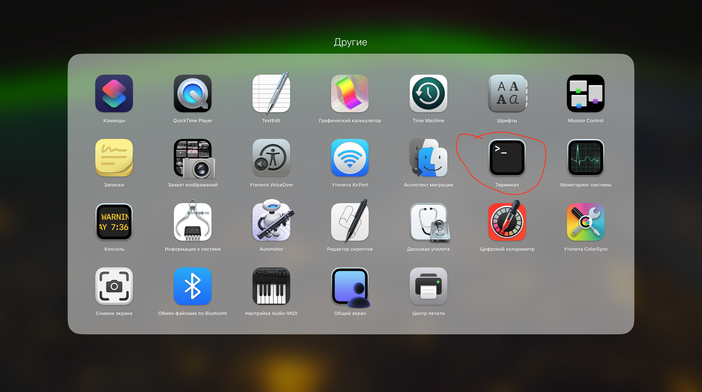
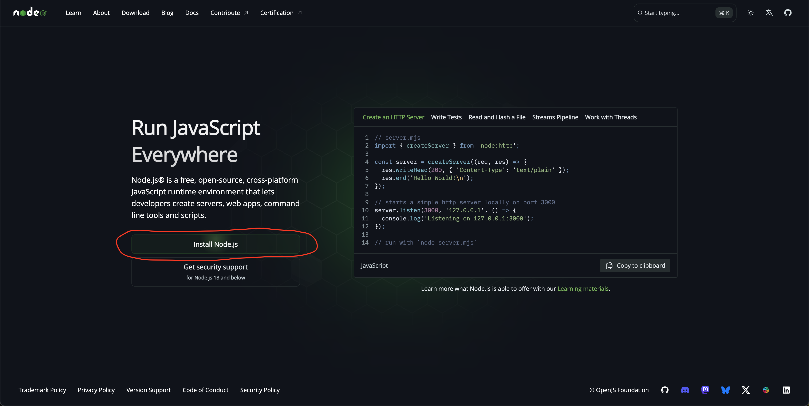
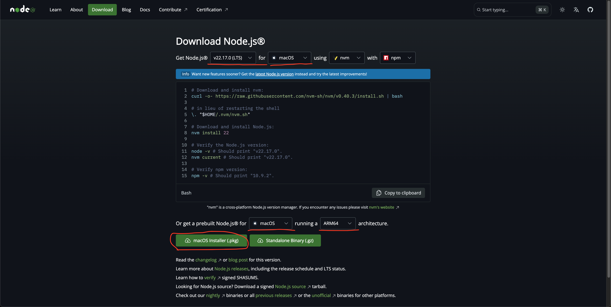

# Установка Node.js на macOS

---

## 1. Проверка, установлен ли Node.js

Откройте **Терминал**  и введите:

```bash
node -v
```

### 👩🏻‍🦳👩🏻‍🦳👩🏻‍🦳 *После введенной команды нажимайте Enter на клавиатуре, чтобы увидеть результат* 👩🏻‍🦳👩🏻‍🦳👩🏻‍🦳

Если вы увидите версию, например `v22.17.0` или выше, значит Node.js уже установлен.  
Если появится ошибка️ — переходите к установке ниже.

---

## 2. Установка через официальный сайт

1. Перейдите на [https://nodejs.org](https://nodejs.org)
2. Скачайте установщик с пометкой **LTS** (это стабильная версия).  
3. Откройте скачанный `.pkg` файл и установите Node.js — как обычное приложение (нажимаем "Далее", "Продолжить" и т.д.).

---

## 3. Проверка после установки

Откройте Терминал и введите команды по очереди:

```bash
node -v
npm -v
```

### 👩🏻‍🦳👩🏻‍🦳👩🏻‍🦳 После введенной команды нажимайте Enter на клавиатуре, чтобы увидеть результат 👩🏻‍🦳👩🏻‍🦳👩🏻‍🦳

Если обе команды возвращают версии — всё установлено правильно.

---

## Что дальше?

Node.js и npm готовы к работе. Можно создавать первый проект, устанавливать пакеты и запускать скрипты.
