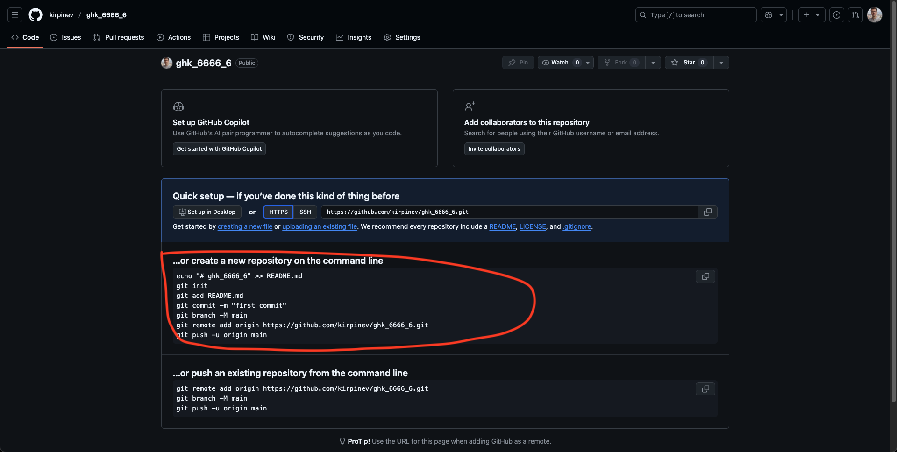

# Пушим изменения на GitHub

Эта инструкция поможет загрузить локальный проект на GitHub в новый репозиторий.

---

## 1. Настраиваем локальный репозиторий

После создания тестового репозитория `ghk_6666_6` в одном из прошлых уроков на странице этого репозитория будет много команд

Нам нужно будет ввести их по отдельности. Открываем терминал в папке проекта и выполняем:

```bash
git init
git add README.md
git commit -m "первый коммит"
git branch -M main
```

---

## 2. Привязываем локальный репозиторий к удалённому на GitHub

Замените `username` и `my-project` на своё имя пользователя и название репозитория:

```bash
git remote add origin https://github.com/username/my-project.git
```

---

## 3. Отправляем изменения на GitHub

```bash
git push -u origin main
```

---

## Готово!

Код загружен в репозиторий на GitHub. Обновления можно загружать приведенными командами ниже:

```bash
git add .
git commit -m "описание изменений"
git push
```
